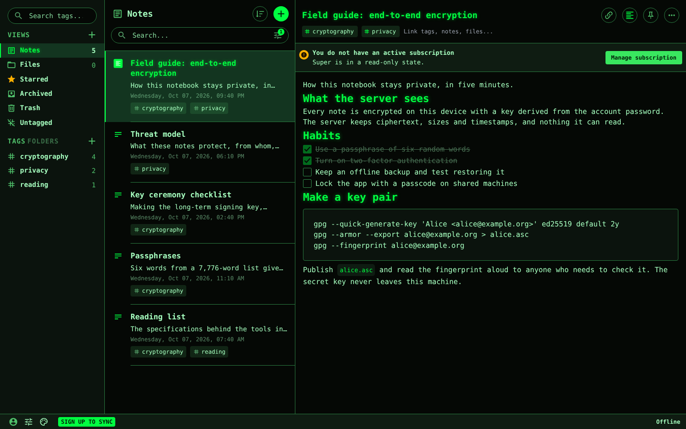
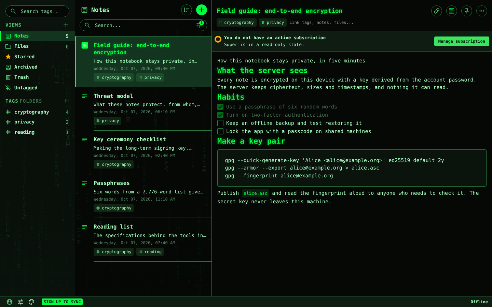
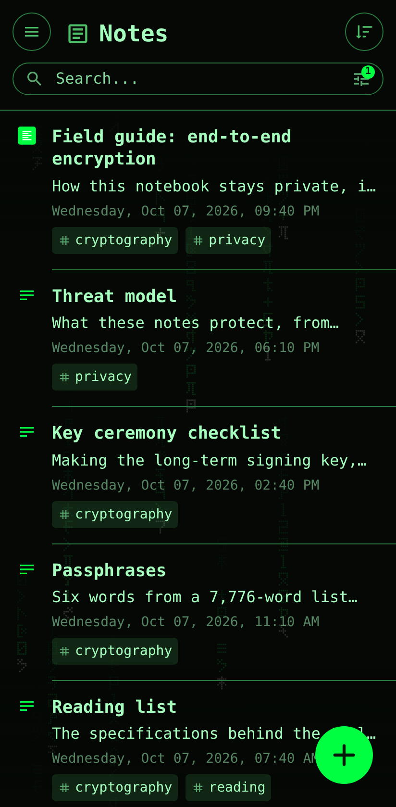

# Cypherpunk

**A green-phosphor cypherpunk theme for Standard Notes, with an optional digital-rain layer.**

Cypherpunk turns [Standard Notes](https://standardnotes.com) into a green-on-black terminal: soft mint text on near-black, bright phosphor green for the things you act on, and monospace type everywhere. Two optional layers stack on top: **Rain**, digital rain falling behind the sidebar and note list, and **Scanlines**, a faint CRT screen. It is plain CSS that loads nothing from anywhere else, and its colors pass WCAG contrast checks.



| With the Rain layer | On a phone, with Rain |
|---|---|
|  |  |

## Install

**Desktop and phone apps**

1. In Standard Notes, open **Preferences → Plugins**.
2. Under **Install Custom Plugin**, paste a URL, choose **Install**, then **Install** again to confirm.
   ```
   https://nickstruglia.github.io/standard-notes-cypherpunk/ext.json
   ```
   Repeat for each layer you want:
   ```
   https://nickstruglia.github.io/standard-notes-cypherpunk/rain/ext.json
   https://nickstruglia.github.io/standard-notes-cypherpunk/scanlines/ext.json
   ```
3. Open the palette menu at the bottom of the sidebar and pick **Cypherpunk**. The layers are listed in the same menu and turn on and off on their own, over Cypherpunk or any other theme.

To use Cypherpunk as the automatic dark theme, turn on **Preferences → Appearance → Use system color scheme** and choose Cypherpunk as the **Automatic Dark Theme**.

**Web app (app.standardnotes.com)**

The web app can't install plugins from a URL: it only fetches plugin manifests from a few hosts, and none of them serve a theme hosted on GitHub. If you are signed in, install on a desktop or phone and the themes sync to the web app. Otherwise, download [`cypherpunk-import.json`](https://nickstruglia.github.io/standard-notes-cypherpunk/cypherpunk-import.json), open **Preferences → Backups → Import backup**, choose the file, then pick the themes from the palette menu. The file only adds the three themes.

If you use the import file in the desktop app, restart the app once before choosing the theme: it downloads the offline copy at launch.

**Updating.** Phones and the web app load the theme from GitHub Pages each time, so they pick up a new release by themselves (Pages caches for about 10 minutes). The desktop app checks at launch and downloads the new version when its number goes up. There is nothing to reinstall.

## The three themes

| Theme | Kind | What it does |
|---|---|---|
| **Cypherpunk** | Main theme | The palette, fonts and details below. |
| **Cypherpunk Rain** | Layer | Digital rain behind the sidebar and note list. |
| **Cypherpunk Scanlines** | Layer | Faint CRT scanlines over the whole app. |

**Rain.** On screens 800px and wider, two fields of rain fall at different speeds behind the sidebar and note list, which turn partly see-through; the editor stays solid. On phones the rain falls inside the note list and pauses while a note is open. The glyphs are an original set of 40 characters on a 5×7 grid (brush-stroke shapes, some mirrored, squared digits and a few symbols), placed by a seeded script so every build is identical, and inlined as SVG. Only `transform` animates, so the browser moves the rain without repainting. The rain draws only in the main app, never inside editors.

**Scanlines.** A dark 1px line every 3px with a faintly lit row between, a soft glow in the middle of the screen and darker corners. It never moves, and clicks pass straight through it.

## What changes

| Role | Color | Contrast |
|---|---|---|
| Background | `#050805` | |
| Panels and menus | `#0b130d` | |
| Raised surfaces | `#0f1c12` | |
| Body text | `#a6ffbf` | 16.94:1 |
| Paragraph text in the app | `#8fe6a8` | 13.47:1 |
| Accent: links, focus, primary buttons, titles | `#00ff41` | 14.74:1 |
| Text on the accent and selected text | `#001a07` | 13.36:1 on `#00ff41` |
| Muted text | `#4fbf6a` | 8.62:1 |
| Placeholders | `#5aa86f` | 6.96:1 |
| Selected note and tag | `#133520` | body text 11.35:1, accent 9.87:1 |
| Borders | `#2a7a40` | 3.79:1 (3.31:1 on raised surfaces) |
| Field borders and scrollbar | `#2f8a49` | 4.65:1 |
| Success | `#39e75f` | 12.24:1 |
| Warning | `#ffb000` | 10.99:1 (dark text on it 9.90:1) |
| Danger | `#ff4d4d` | 6.15:1 (dark text on it 6.05:1) |

Contrast is against the background unless noted. Note-type icons keep distinct hues (pink, violet, cyan, orange, amber) at 7.50:1 or more.

- **Body text is soft mint, not bright green.** Pure `#00ff41` tires the eyes over long notes, so it is kept for accents.
- **Errors still look like errors.** Danger and warning stay red and amber.
- **Fonts:** an all-monospace system stack with nothing to download: `ui-monospace, "Cascadia Mono", "SF Mono", Menlo, Consolas, "Roboto Mono", "DejaVu Sans Mono", monospace`. It applies to the app, the Plain and Super editors and the note title.
- **Touches:** green selection with dark text, a bright green caret (a block caret in browsers that support `caret-shape`), a green scrollbar thumb, clear focus rings, and a faint glow on headings, the note title and the selected note and tag, never on body text. Switches dim their track when off, so off never reads as lit. Code blocks in Super notes get a terminal palette of green, amber and cyan.
- **Translucent UI** works as usual: menus take the theme's background at the app's 65% opacity, and the phone status bar and browser theme color turn `#050805`.
- **Print:** black on white with no glow, because Standard Notes also loads themes for printing.

## Accessibility and motion

| Setting | Cypherpunk | Rain | Scanlines |
|---|---|---|---|
| Reduce motion | Nothing moves | Stays, frozen | Nothing moves |
| Reduce data | | Off | |
| Reduce transparency | | Off, panels go solid | |
| Increase contrast | | Off, panels go solid | Off |
| Forced colors (high contrast modes) | System colors take over | Off | Off |
| Print | Black on white | Not printed | Not printed |

Reduce data follows `prefers-reduced-data`, which few browsers support yet; the other rows follow the matching system settings.

Every text color meets 4.5:1 and every border and focus ring 3:1 against the surfaces it sits on; printed text meets 7:1. `npm test` checks about 130 color pairs and fails if one drops below its minimum.

## Privacy

- Plain CSS: no JavaScript.
- Every asset (the rain tiles and one checkmark) is inline as a `data:` URI, and there are no web fonts, so the theme makes no network requests of its own. The tests fail on any outside URL or `@import`.
- Because nothing is fetched, it also works inside editors with strict security policies, such as Keyfold.

## Compatibility

- **Web app** (app.standardnotes.com): with the import file or by sync. Covered by the live tests.
- **Desktop app:** installed by URL on Linux, including the offline copy (the app downloads the zip and serves it locally). Windows and macOS run the same app but were not tested separately.
- **Android:** installed by URL; the status bar turns dark.
- **iPhone:** not yet verified.
- **Editors:** the Plain and Super editors, and third-party editors that read the theme's variables.

Written against the Standard Notes web app v3.202.8 (October 2026).

Pairs with [Keyfold](https://github.com/nickstruglia/standard-notes-keyfold), an editor for seed phrases and keys that wears the active theme. Install it from `https://nickstruglia.github.io/standard-notes-keyfold/ext.json`.

## Live preview

The [project page](https://nickstruglia.github.io/standard-notes-cypherpunk/) is a mock of the Standard Notes layout wearing the theme, with switches for the theme and both layers, and the install links. Add `?layers=rain,scanlines` to start with the layers on, or `?theme=none` to see the layout without the theme.

## Development

Requires Node.js 22.

```bash
npm ci
npm run build          # dist/: the three stylesheets, manifests, zips and the import file
npm test               # builds, then checks contrast, budgets, URLs, manifests, zips and the rain tiles
npm run keyfold        # builds the Keyfold editor at a pinned commit into .cache/keyfold (network once)
npm run test:e2e       # Playwright on the preview page and Keyfold, desktop and Pixel 7 sizes
npm run test:live      # the real Standard Notes web app (needs the network; not run in CI)
npm run screenshots    # retakes the images in docs/ in the real web app
npm run serve          # http://127.0.0.1:4173/dev/preview.html
```

The sources are `src/cypherpunk.css`, `src/rain.css` and `src/scanlines.css`. `scripts/rain-svg.mjs` draws the rain tiles, and `node scripts/rain-svg.mjs glyphs` prints the glyph sheet as SVG. `dev/preview.html` is the preview page (the build copies it to the site root), and `dev/keyfold.html` frames Keyfold the way Standard Notes does.

The live tests and the screenshot script answer requests for the GitHub Pages URLs from `dist/`, so they test the local build before it is deployed.

Bump `version` in `package.json` for every release: the desktop app only downloads a new copy when the version goes up.

## Deploy your own copy

1. Fork this repository.
2. In the fork, go to **Settings → Pages** and set **Source** to **GitHub Actions**.
3. Edit `homepage` and `repository` in `package.json` to point at your fork, run `npm run build` and `npm test`, and push to the default branch.
4. Install `https://<your-username>.github.io/standard-notes-cypherpunk/ext.json` in Standard Notes.

The deploy workflow writes your Pages URL into the manifests and the import file and publishes the zips for the desktop app's offline copy. `dist/` is built there, so it is not committed.

## Not affiliated with Standard Notes

Cypherpunk is an independent theme. It is not made, endorsed or supported by Standard Notes.

## License

[MIT](LICENSE) © 2026 Nicholas Truglia
